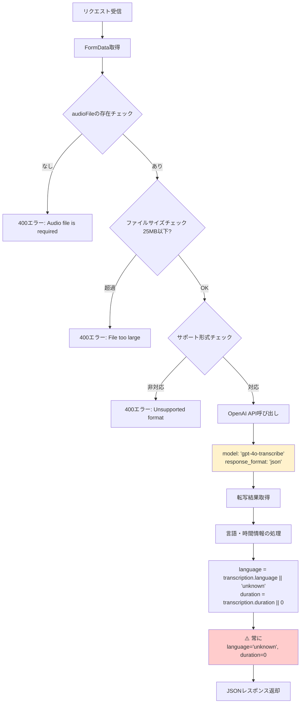
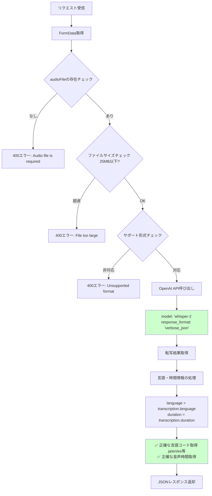

# 0031 – 言語検出機能のためのwhisper-1モデルへの復帰

## 背景 / Context

音声転写でgpt-4o-transcribeモデルを使用していたが、`response_format: 'json'`では言語検出情報（language）が取得できず、全ての音声で`unknown`が返される問題が発生した。ユーザーの多言語対応要求に応えるため、言語検出機能の復活が必要となった。

---

## 決定 / Decision

音声転写モデルを`gpt-4o-transcribe`から`whisper-1`に戻し、`response_format: 'verbose_json'`を使用して言語検出機能を復活させる。

---

## 理由 / Rationale

- gpt-4o-transcribeは`verbose_json`をサポートしておらず、言語検出情報を取得できない
- ユーザーが多言語対応（言語自動検出）機能を必要としている
- whisper-1は`verbose_json`で言語・時間情報を確実に提供
- 転写精度は若干低下するが、機能要求を優先

---

## 実装詳細 / Implementation Notes

### 1. 音声認識モデルの復帰

```ts
const transcription = await client.audio.transcriptions.create({
  file: audioFile,
  model: 'whisper-1', // 言語検出のためwhisper-1に戻す
  response_format: 'verbose_json', // 言語情報を含む詳細なレスポンス形式
  temperature: 0.2,
});
```

理由:
- `whisper-1`は`verbose_json`をサポート
- 言語・時間情報を確実に取得可能

### 2. TypeScript型定義の調整

```ts
// OpenAI Whisper-1 verbose_jsonレスポンスの型定義
interface TranscriptionResponse {
  text: string;
  language: string;   // verbose_jsonでは必須
  duration: number;   // verbose_jsonでは必須
}
```

理由:
- `verbose_json`では`language`と`duration`が必須プロパティ
- オプショナルプロパティから必須プロパティに変更

### 3. レスポンス処理の簡素化

```ts
// verbose_jsonなので言語と期間情報が確実に取得できる
const transcriptionData = transcription as TranscriptionResponse;
const language = transcriptionData.language;
const duration = transcriptionData.duration;

return NextResponse.json({
  text: transcription.text,
  language: language, // 検出された言語コード（es, ja, en など）
  duration: duration, // 音声の長さ（秒）
  timestamp: new Date().toISOString(),
});
```

理由:
- フォールバック値（`|| 'unknown'`）が不要
- 型安全性の向上
- 確実な言語検出結果の提供

---

## 処理フローの比較

### 元々の処理フロー（gpt-4o-transcribe使用時）



### 変更後の処理フロー（whisper-1使用時）



**主な違い:**
- **APIパラメータ**: `gpt-4o-transcribe` + `json` → `whisper-1` + `verbose_json`
- **言語検出**: `unknown`固定 → 正確な言語コード (`ja`, `en`, `es`等)
- **時間情報**: `0`固定 → 実際の音声長（秒）

---

## 影響 / Consequences

- 言語検出機能が正常に動作し、適切な言語コード（ja, en, es等）が返される
- 音声の時間情報も正確に取得可能
- 転写精度は`gpt-4o-transcribe`比で若干低下する可能性
- APIレスポンス形式は変更なし（既存フロントエンドとの互換性維持）
- コストへの影響は最小限（同じOpenAI Whisper系API）

---

## 技術的なポイント

- `verbose_json`フォーマットの活用により、豊富なメタデータ取得が可能
- TypeScript型安全性の向上により実行時エラーリスクを軽減
- 多言語対応アプリケーションでは言語検出機能が重要な価値を提供

---

## 参考 / References

- 関連ADR: [0004-gpt-4o-transcribe-migration.md](./0004-gpt-4o-transcribe-migration.md) - gpt-4o-transcribeへの移行（今回は部分的に戻す判断）
- 関連ADR: [0030-whisper-api-response-format-compatibility-fix.md](./0030-whisper-api-response-format-compatibility-fix.md) - 互換性問題の修正

---